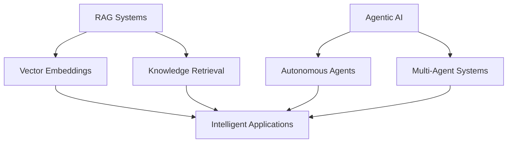

# 🚀 Hello, I'm Sudipto Mondal

<div align="center">
  
</div>

<div align="center">
  
</div>

<div align="center">
  
  
</div>

---

## 🎯 About Me


```typescript
class SudiptoMondal {
  name: string = "Sudipto Mondal";
  role: string = "Full Stack Developer & AI Enthusiast";
  location: string = "India 🇮🇳";
  
  skills: {
    frontend: string[];
    backend: string[];
    ai_ml: string[];
    databases: string[];
    tools: string[];
  } = {
    frontend: ["React", "Next.js", "TypeScript", "Redux"],
    backend: ["Node.js", "Express", "GraphQL", "Prisma"],
    ai_ml: ["RAG Systems", "Agentic AI", "LangChain"],
    databases: ["PostgreSQL", "MongoDB"],
    tools: ["Docker", "Git", "Postman"]
  };
  
  currentFocus: string[] = [
    "🤖 Building intelligent AI applications",
    "🔍 Developing RAG-powered systems",
    "🚀 Creating scalable web solutions",
    "💡 Exploring cutting-edge technologies"
  ];
  
  getInTouch(): string {
    return "msudipta857@gmail.com";
  }
}
```

---

## 🛠️ Tech Arsenal

### 🎨 **Frontend Development**
<p align="left">
  
  
  
  
  
  
  
  
  
</p>

### ⚙️ **Backend Development**
<p align="left">
  
  
  
  
</p>

### 🤖 **AI & Machine Learning**
<p align="left">
  
  
  
  
  
</p>

### 🗄️ **Database & ORM**
<p align="left">
  
  
  
  
</p>

### 🛠️ **DevOps & Tools**
<p align="left">
  
  
  
  
  
</p>

### 💻 **Programming Languages**
<p align="left">
  
  
  
  
  
</p>

---

## 🚀 Current Focus Areas

<div align="center">

### 🤖 **AI Innovation**


</div>

<table>
  <tr>
    <td align="center" width="50%">
      <h3>🔍 RAG Systems</h3>
      <p>Building intelligent retrieval-augmented generation systems that combine the power of large language models with real-time data access</p>
    </td>
    <td align="center" width="50%">
      <h3>🤖 Agentic AI</h3>
      <p>Developing autonomous AI agents that can reason, plan, and execute complex tasks independently</p>
    </td>
  </tr>
  <tr>
    <td align="center" width="50%">
      <h3>🌐 Full Stack Development</h3>
      <p>Creating scalable, modern web applications with cutting-edge technologies and best practices</p>
    </td>
    <td align="center" width="50%">
      <h3>💡 Innovation</h3>
      <p>Always exploring new technologies and pushing the boundaries of what's possible</p>
    </td>
  </tr>
</table>

---

## 🌐 Let's Connect & Collaborate

<div align="center">
  <a href="https://linkedin.com/in/sudipta-mondal-009625255" target="_blank">
    
